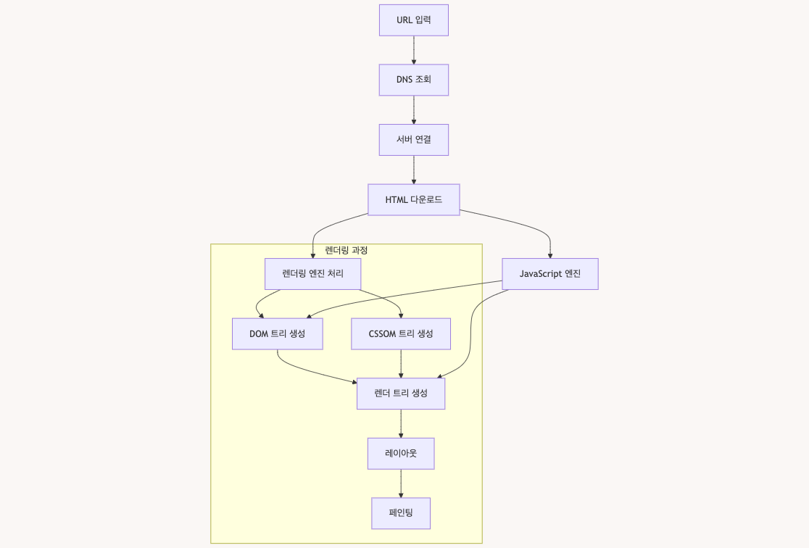

# 브라우저 동작 원리



#### 1. URL 입력 -> 서버 접속

- DNS를 통해 도메인을 IP 주소로 변환
- 해당 서버와 연결을 수립

#### 2. 리소스 다운로드

- 서버로부터 HTML 문서를 받음
- 필요한 CSS, Javascript 파일도 함께 다운로드

#### 3. 렌더링 과정

**3.1 HTML을 파싱하여 DOM트리 생성**

- HTML 파일을 파싱하여 트리 구조로 변환
- 각 HTML 태그는 노드가 되어 트리를 구성
- 예시

```html
<html>
  <head>
    <title>제목</title>
  </head>
  <body>
    <div>내용</div>
  </body>
</html>
```

**3.2 CSS를 파싱하여 CSSOM 트리 생성**

- CSS 파일을 파싱하여 스타일 규칙의 트리 구조 생성
- 스타일 상속과 계단식 규칙 적용
- 예시

```css
body {
  font-size: 16px;
}
div {
  color: blue;
}
```

**3.3 두 트리를 결합하여 렌더 트리 생성**

- DOM 트리와 CSSOM 트리를 결합
- 실제 화면에 표시될 요소만 포함
- `display: none` 인 요소는 제외
- `visible: hidden` 인 요소는 공간을 차지하므로 포함

**3.4 레이아웃**

- 각 노드의 정확한 위치와 크기 계산
- 뷰포트 내에서 상대적 위치 결정
- 반응형 디자인의 경우 화면 크기에 따라 재계산
- 이 과정이 자주 일어나면 성능 저하 발생 (리플로우)

**3.5 페인팅**

- 실제 화면의 픽셀로 변환하는 과정
- 텍스트, 색상, 이미지, 그림자 등 모든 시각적 요소를 그림
- 여러 레이어로 나누어 처리될 수 있음
- 이 과정도 자주 일어나면 성능 저하 발생 (리페인트)

**성능 최적화 관점에서 주의할 점**

- 레이아웃과 페인팅은 비용이 큰 작업
- CSS 애니메이션은 `transform` 사용 권장 (레이어 생성)
- Javascript로 DOM 조작 시 한 번에 처리 (**레이아웃 쓰로틀링**)
- 불필요한 레이아웃/페인팅 최소화

**레이아웃 쓰로틀링**

- 브라우저의 리플로우(레이아웃 재계산)를 최소화하기 위한 최적화 기법
- 주요 목적
  - 불필요한 레이아웃 재계산 방지
  - 여러 스타일 변경을 일괄 처리
  - DOM 조작 성능 최적화

#### 4. Javascript 처리

- 자바스크립트 코드 실행
- DOM 조작이나 이벤트 처리 수행

---

#### 서버에서 리소스 다운 후 브라우저에서 렌더링 하는 과정

1. HTML 파싱 시작
2. HTML 파싱 중 CSS나 Javascript를 만나면

- CSS : 파싱을 계속 진행하면서 병렬로 CSS 처리
- Javascript
  - 일반 `<script>` : HTML 파싱 중단하고 Javascript 실행
  - `<script> 속 async` : 다운로드는 병렬로, 실행 시 HTML 파싱 중단
  - `<script> 속 defer` : 다운로드는 병렬로, HTML 파싱 완료 후 실행

실행 순서는 상황에 따라 달라질 수 있지만, 이는 웹 성능에 큰 영향을 미칠 수 있음
