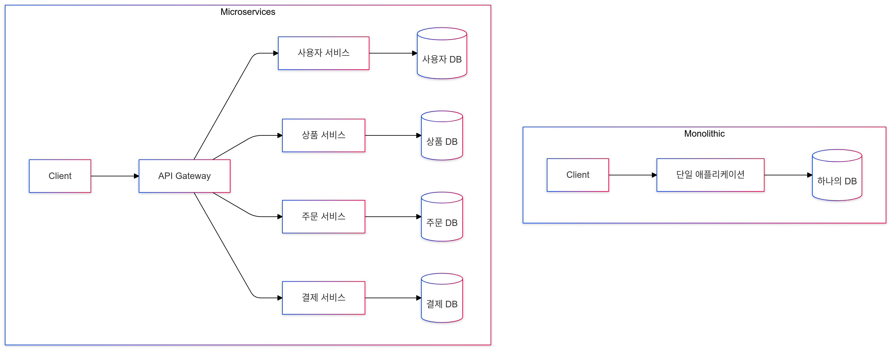

# MSA (Micro Service Architecture)

## 목차

- [MSA란?](#msa란)
- [MSA의 특징](#msa의-특징)
- [MSA 장단점](#msa-장단점)
- [실제 적용 사례](#실제-적용-사례)
- [MSA가 필요한 상황](#msa가-필요한-상황)
- [MSA 전환 시 흔한 실수](#msa-전환-시-흔한-실수)

---

### MSA란?

- 하나의 큰 애플리케이션을 여러 개의 작은 애플리케이션으로 쪼개어 변경과 조합이 가능하도록 만든 아키텍처
- 큰 서비스를 작은 서비스들로 쪼개서 운영하는 방식
- 작은 예시
  
  - MSA 이전 전통적인 방식 (Monolithic)
  ```
  하나의 큰 서비스 안에
  - 사용자 관리
  - 상품 관리
  - 주문 관리
  - 결제 관리
  모든 기능이 들어있음
  ```
  - MSA 방식
  ```
  각각의 독립된 서비스로 분리
  - 사용자 서비스
  - 상품 서비스
  - 주문 서비스
  - 결제 서비스
  각각이 독립적으로 운영됨
  ```
  - Monolithic이란? 하나의 애플리케이션에 모든 기능이 통합되어 있는 구조

---

### MSA의 특징

1. 독립성

- 각 서비스는 독립적으로 개발/배포 가능
- 예) 결제 서비스만 업데이트 가능

2. 유연성

- 각 서비스마다 다른 기술 사용 가능
- 예) 결제 서비스는 JAVA, 검색 서비스는 Python 사용 가능

3. 확장성

- 필요한 서비스만 확장 가능
- 예) 주문이 많아지면 주문 서비스만 확장

---

### MSA 장단점

#### 1. 장점

```
1-1. 서비스별 독립적 배포 가능
- 예) 결제 시스템만 업데이트 가능

1-2. 서비스별 확장 가능
- 예) 트래픽 많은 서비스만 확장

1-3. 다양한 기술 사용 가능
- 예) 각 서비스에 최적화된 언어/DB 선택
```

#### 2. 단점

```
2-1. 서비스 간 통신 복잡성
- 예) 각 서비스가 API로 통신해야 함

2-2. 데이터 일관성 관리 어려움
- 예) 주문/결제 데이터가 다른 DB에 있음

2-3. 운영 복잡도 증가
- 예) 모니터링/로깅이 더 복잡해짐
```

---

### MSA가 필요한 상황

1. 트래픽이 많은 경우

- 예) 상품 조회는 많지만, 결제는 적은 경우
- 상품 서비스만 확장 가능

2. 빠른 업데이트가 필요한 경우

- 예) 결제 시스템만 수정이 필요한 경우
- 결제 서비스만 배포 가능

3. 다양한 기술이 필요한 경우

- 예) 검색은 Elasticsearch, 결제는 Spring Boot
- 각 서비스에 최적화된 기술 사용 가능

---

### MSA 전환 시 흔한 실수

1. 너무 작은 단위로 쪼개기

- 서비스가 많아지면 관리가 어려움
- 적절한 크기로 분리 필요

2. 공통 데이터 처리 미흡

- 예) 회원 정보가 여러 서비스에 필요한 경우
- 데이터 동기화 전략 필요

3. 통신 방식 설계 부족

- 동기/비동기 통신 선택
- 장애 상황 대비 필요
