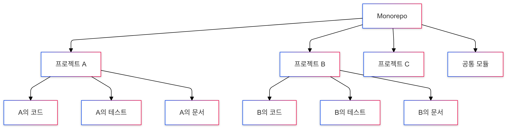
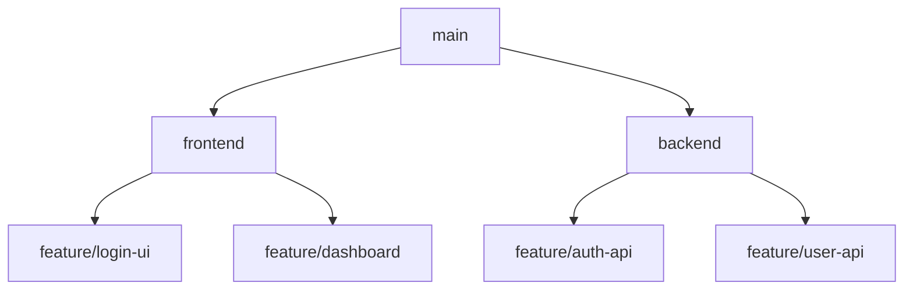
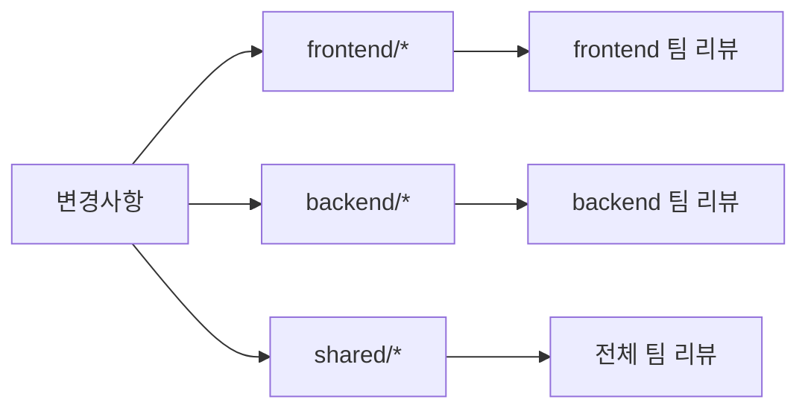

# MonoRepo

## 목차

- [MonoRepo란?](#monorepo란)
- [모노레포의 장단점](#모노레포의-장단점)
  - [장점](#1-장점)
  - [단점](#2-단점)
- [모노레포의 커밋 관리](#모노레포의-커밋-관리)
  - [효과적으로 관리하는 여러 방법들](#효과적으로-관리하는-여러-방법들)

---

### MonoRepo란?

```
'Monolithic Repository'의 줄임말로, 여러 프로젝트의 코드를 하나의 레포지토리에서 관리하는 개발 방식
```



- 간단예제

  - 모노레포

  ```
  📁 company-monorepo/
  ├── 📁 packages/
  │   ├── 📁 frontend/
  │   ├── 📁 backend/
  │   └── 📁 shared/
  ├── package.json
  └── README.md
  ```

  - 멀티레포 (다중 저장소)

  ```
  📁 frontend-repo/
  ├── 📁 src/
  └── package.json

  📁 backend-repo/
  ├── 📁 src/
  └── package.json

  📁 shared-repo/
  ├── 📁 src/
  └── package.json
  ```

---

### 모노레포의 장단점

#### 1. 장점

- **1-1 코드 재사용 용이성**
  - 공통 코드를 쉽게 공유
  - 중복 코드 감소
  - 일관된 코딩 스타일 유지
- **1-2. 의존성 관리**
  - 프로젝트 전체의 의존성을 중앙화
  - 버전 충돌 방지
  - 일관된 버전 관리
- **1-3. 리팩토링 용이성**
  - 전체 코드베이스에 대한 변경 용이
  - 영향도 파악 쉬움
- **1-4. 협업 효율성**
  - 코드 검색 용이
  - 이슈 트래킹 통합
  - PR 리뷰 프로세스 통합

#### 2. 단점

- **2-1. 저장소 크기**
  - Git 저장소 크기 증가
  - 초기 클론 시간 증가
- **2-2. 빌드 시간**
  - 전체 빌드 시 시간 증가
  - CI/CD 파이프라인 복잡성
- **2-3. 접근 권한**
  - 세분화된 권한 관리의 어려움
  - 보안 이슈 가능성

---

### 모노레포의 커밋 관리

```
모노레포에서의 커밋 관리는 아주 중요한 이슈이다. 왜냐하면 간단한 예를 들어 frontend, backend, service 등 여러개의 프로젝트를 하나의 레포지토리에서 관리하기 때문에 여러 프로젝트의 변경사항이 혼재하기 때문이다.
```

#### 효과적으로 관리하는 여러 방법들

**1. 커밋 메시지 컨벤션**

```
- feat(frontend) : 로그인 UI 구현
- feat(backend) : 인증 API 추가
- fix(shared) : 공통 유틸리티 버그 수정
```

- 접두어로 프로젝트/영역을 명시
- 범위(scope)를 통해 어느 부분에 변경인지 명확히 함
  <br />

**2. 브랜치 전략**



- 프로젝트별 브랜치 관리
- 기능별 하위 브랜치로 구분
- 브랜치 네이밍 컨벤션

```
[프로젝트]/[타입]/[설명]
예시:
- frontend/feature/login
- backend/fix/auth-bug
- shared/chore/update-deps
```

<br />

**3. 변경사항 구분**



<br />

**4. 실제 관리 도구 사용**

- 4-1. Conventional Commits

```
# 자동으로 커밋 메시지 포맷 검사
feat(scope): 설명
fix(scope): 설명
chore(scope): 설명
```

- 4-2. Changesets
  - 변경사항 추적 및 버전 관리
  - 영향받는 패키지들 자동 감지
- 4-3. Git Hooks (Husky 등)

```json
{
  "husky": {
    "hooks": {
      "commit-msg": "commitlint -E HUSKY_GIT_PARAMS",
      "pre-commit": "lint-staged"
    }
  }
}
```
