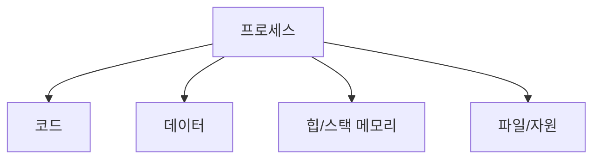
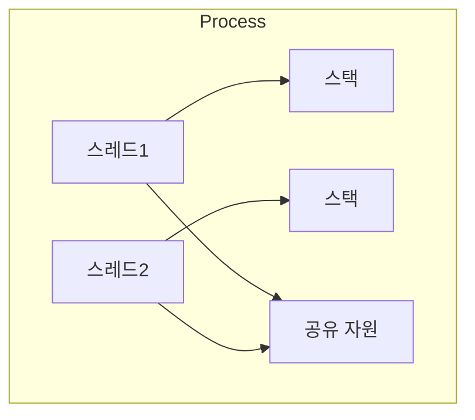
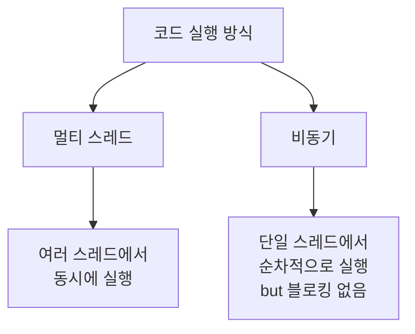

# 스레드, 프로세스

## 목차

- [프로세스란](#프로세스란-process)
- [스레드란](#스레드란-thread)
- [주요 차이점](#주요-차이점)
- [실제 개발에서 고려할 점](#실제-개발에서-고려할-점)
- [주니어 개발자가 알아야 할 추가 개념](#주니어-개발자가-알아야-할-추가-개념)
- [멀티 스레드 vs 비동기](#멀티-스레드-vs-비동기)
- [Node.js 특별한 점](#nodejs-특별한-점)
- [마치며](#마치며)

---

### 프로세스란 (Process)

프로세스는 실행 중인 프로그램을 의미



**주요 특징**

- 독립된 메모리 공간
- 다른 프로세스와 자원 공유 불가
- 프로세스 간 통신(IPC)이 필요
- 컨텍스트 스위칭 비용이 큼

---

### 스레드란 (Thread)

프로세스 내에서 실행되는 작업의 단위



**주요 특징**

- 프로세스 내 자원 공유
- 스레드 간 통신이 쉬움
- 컨텍스트 스위칭 비용이 적음
- 동시성 문제 주의 필요

---

### 주요 차이점

- 1. 메모리 구조

  ```
  프로세스:
  - 독립적인 메모리 공간
  - Code, Data, Stack, Heap 영역 분리

  스레드:
  - Stack만 독립적
  - Code, Data, Heap 영역 공유
  ```

- 2. 리소스 사용
  - 프로세스 : 많은 시스템 자원 필요
  - 스레드 : 적은 시스템 자원 사용
- 3. 통신 방식
  - 프로세스 : IPC 필요 (파이프, 소켓 등)
  - 스레드 : 공유 메모리로 직접 통신

---

### 실제 개발에서 고려할 점

- 1. 멀티프로세스 vs 멀티스레드 선택
  ```mermaid
  graph TD
    A[작업 특성] --> B[CPU 집약적]
    A --> C[I/O 집약적]
    B --> D[멀티프로세스 유리]
    C --> E[멀티스레드 유리]
  ```

---

### 주니어 개발자가 알아야 할 추가 개념

- 1. 비동기 처리

  ```js
  // Promise 사용
  const processData = async () => {
    try {
      // 병렬로 여러 작업 처리
      const results = await Promise.all([
        fetchUserData(),
        fetchOrderData(),
        fetchProductData(),
      ]);

      return results;
    } catch (error) {
      console.error('데이터 처리 중 에러:', error);
      throw error;
    }
  };

  // 이벤트 기반 비동기 처리
  const EventEmitter = require('events');
  const myEmitter = new EventEmitter();

  myEmitter.on('dataProcessed', (data) => {
    console.log('데이터 처리 완료:', data);
  });

  // 데이터 처리 후 이벤트 발생
  processData().then((data) => {
    myEmitter.emit('dataProcessed', data);
  });
  ```

- 2. 메모리 관리

  ```js
  // 메모리 사용량 모니터링
  const used = process.memoryUsage();
  console.log({
    heapTotal: `${Math.round((used.heapTotal / 1024 / 1024) * 100) / 100} MB`,
    heapUsed: `${Math.round((used.heapUsed / 1024 / 1024) * 100) / 100} MB`,
  });

  // 대용량 데이터 처리
  const { createReadStream, createWriteStream } = require('fs');

  const processLargeFile = () => {
    const readStream = createReadStream('large-file.csv');
    const writeStream = createWriteStream('output.csv');

    readStream
      .pipe(processData())
      .pipe(writeStream)
      .on('finish', () => console.log('처리 완료'));
  };
  ```

- 3. 동시성 패턴

  - 1. 작업 큐 구현

    ```js
    const Queue = require('bull');

    // Redis 기반 작업 큐 생성
    const processQueue = new Queue('data-processing');

    // 작업 추가
    processQueue.add({ data: 'processThis' });

    // 작업 처리
    processQueue.process(async (job) => {
      const { data } = job.data;
      // 실제 작업 처리
      return processResult;
    });

    // 작업 완료 이벤트
    processQueue.on('completed', (job, result) => {
      console.log(`Job ${job.id} completed with result:`, result);
    });
    ```

  - 2.  서비스 간 통신
        ```js
        // Express와 Socket.IO를 사용한 실시간 통신
        const express = require('express');
        const { Server } = require('socket.io');
        const app = express();
        const server = require('http').createServer(app);
        const io = new Server(server);

            io.on('connection', (socket) => {
            socket.on('processData', async (data) => {
                try {
                const result = await processData(data);
                socket.emit('processComplete', result);
                } catch (error) {
                socket.emit('processError', error.message);
                }
            });
            });
            ```

        이처럼 node.js에서 싱글 스레드 이벤트 루프를 기반으로 하면서도 필요한 경우 cluster나
        worker threads를 통해 멀티 프로세싱/스레딩을 구현할 수 있습니다. 특히 실무에서는
        비동기 처리와 이벤트 기반 프로그래밍이 매우 중요!

---

### 멀티 스레드 vs 비동기



- 1. 멀티 스레드
  - 실제로 여러 작업이 동시에 실행됨
  - CPU 자원을 실제로 여러개 사용

2. 비동기

- 하나의 스레드에서 작업을 번갈아가며 실행
- CPU 자원은 하나만 사용

#### 주요 차이점

- 1. 자원 사용
  - 멀티 스레드 : 여러 CPU 코어 사용
  - 비동기 : 단일 CPU 코어 사용
- 2. 실행 방식
  - 멀티 스레드 : 실제 동시 실행
  - 비동기 : 순차적 실행 (블로킹 없음)
- 3. 적합한 작업
  - 멀티 스레드 : CPU 집약적 작업
  - 비동기 : I/O 작업 (파일, 네트워크 등)

---

#### Node.js 특별한 점

Node.js는 기본적으로 싱글 스레드 + 비동기 모델을 사용하지만,

1. Worker Threads로 멀티 스레드 구현 가능
2. Cluster 모듈로 멀티 프로세스 구현 가능

---

#### 마치며

프로세스는 독립적인 메모리 공간을 가지며, OS로부터 자원을 할당받고, 최소 하나의 스레드를 포함해야 합니다.
스레드는 프로세스 내에서 실제을 수행하는 단위이며, 프로세스의 자원을 공유받아 각자 독립적인 스택만 가집니다.

이해하기 쉽게 카톡 앱으로 설명하자면,

- 카카오톡 앱 자체가 프로세스
- 채팅, 파일 전송, UI 업데이트 등 이런 작업들이 스레드에 해당
