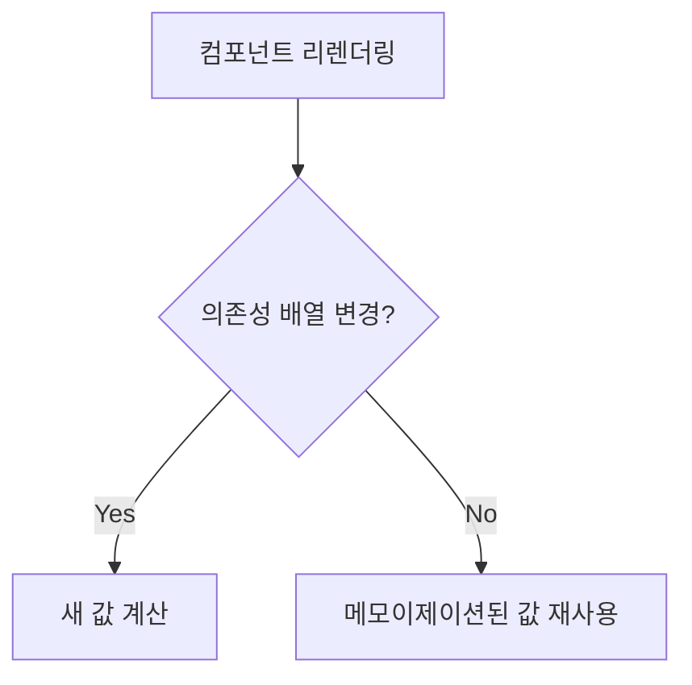

# React -> useMemo, useCallback

## 목차

- [Memozation이란](#memozation이란)
- [React에서의 Memoization](#react에서의-memoization)
- [사용이 필요한 경우](#사용이-필요한-경우)

---

### Memozation이란

```
Memoization은 비용이 큰 연산의 결과를 캐싱하여 재사용하는 프로그래밍 기법
```



---

### React에서의 Memoization

**1. useMemo: 값의 Memoization**

```js
// 비용이 큰 계산
const heavyCalculation = useMemo(() => {
  return data.reduce((acc, item) => {
    // 복잡한 계산 수행
    return acc + expensiveOperation(item);
  }, 0);
}, [data]); // data가 변경될 때만 재계산
```

**2. useCallback: 함수의 Memoization**

```js
// 메모이제이션된 함수
const handleSubmit = useCallback(
  (values) => {
    // 폼 제출 로직
    submitForm(values);
  },
  [submitForm]
); // submitForm이 변경될 때만 재생성
```

**3. React.memo: 컴포넌트의 Memoization**

```js
const MemoizedComponent = React.memo(function MyComponent(props) {
  return <div>{props.value}</div>;
});
```

---

### 사용이 필요한 경우

**1. 비용이 큰 계산**

- 간단한 계산은 오히려 성능 개선에 역효과

```js
// 필요한 경우
const sortedData = useMemo(() => {
  return expensiveSort(largeDataset);
}, [largeDataset]);

// 불필요한 경우
const message = useMemo(() => {
  return 'Hello ' + name;
}, [name]); // 간단한 연산은 메모이제이션 불필요
```

**2. 참조 동일성이 필요한 경우**

```js
// Props로 전달되는 콜백
const handleChange = useCallback((e) => {
  setValue(e.target.value);
}, []); // 의존성이 없으면 항상 같은 참조 유지
```

**3. 컴포넌트의 리렌더링 방지**

```js
const MemoizedComponent = React.memo(function MyComponent(props) {
  return <div>{props.value}</div>;
});
```

**<h4>주의사항</h4>**

1. 메모리 사용

- 메모이제이션도 메모리를 사용함
- 모든 것을 메모이제이션하면 역효과

2. 의존성 배열 관리

- 빈 의존성 배열은 위험
  - 실제 최적화가 필요한 경우에만 선택적으로 사용하는게 좋음

```js
// 잘못된 사용
const value = useMemo(() => {
  return compute(props.data);
}, []); // 빈 의존성 배열은 위험

// 올바른 사용
const value = useMemo(() => {
  return compute(props.data);
}, [props.data]);
```
